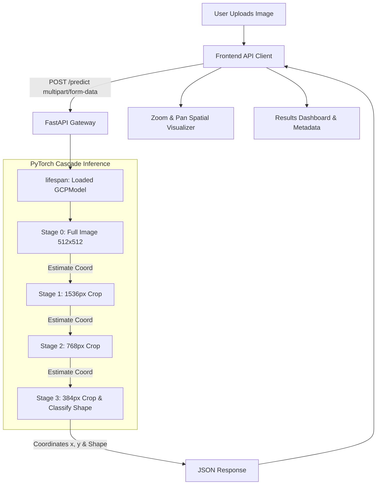

# Skylark GCP Pose Estimation System

A production-grade, end-to-end computer vision platform designed to localize Ground Control Points (GCPs) and classify marker shapes in high-resolution aerial imagery. 

The project connects a **Next.js 15 / TypeScript** web frontend to a **FastAPI / PyTorch** backend serving an **EfficientNet-B3** multi-stage crop cascade regression model.

**Pretrained weights:** https://drive.google.com/file/d/1foVQ4ED3TafLvuFyQrbcC9fcxW341nUv/view?usp=sharing

**Test Data predictions:** `sample_predictions/predictions.json`

---

## Architecture Overview

The core capability of the system is resolving scale-variance issues of GCPs in drone photography. High-resolution photos are passed through an iterative cropping cascade to achieve sub-pixel accuracy.



---

## 1. Network Architecture Choice & Rationale

Locating keypoints in high-resolution drone photography presents a severe needle-in-a-haystack challenge. We chose a **Multi-Task Coarse-to-Fine Cascade** model architecture to split this challenge into sequential stages.

* **Backbone (EfficientNet-B3):** We utilize an EfficientNet-B3 backbone (pretrained on ImageNet) rather than heavier models (like ResNet50 or ConvNeXt) because it offers an optimal trade-off between floating-point operations (FLOPs) and rich spatial feature extraction. The early stages of EfficientNet extract strong high-frequency edges crucial for detecting the corners of artificial GCP markers.
* **Feature Neck:** We discard the standard global classification pooling. Spatial features are flattened or passed through a custom **Spatial Attention Pooling** layer that weights the 2D feature grid before outputting a 1536-dimensional representation, helping the network locate markers off-center.
* **MLP Regression Head:** Standard fully connected MLP layers mapping to $256 \rightarrow \text{ReLU} \rightarrow 64 \rightarrow \text{ReLU} \rightarrow 2$ output units. A **Sigmoid** activation function restricts output coordinates to the range `[0, 1]`, representing the normalized location within the current crop boundary.
* **MLP Classification Head:** Branches off the same feature neck to map to $256 \rightarrow \text{ReLU} \rightarrow \text{Dropout} \rightarrow 3$ units, outputting shape class probabilities (Cross, L-Shaped, Square).

---

## 2. Training Strategy

Our training routine is structured around multi-scale inputs to enable the single model parameters file to run both coarse localization and fine sub-pixel alignment stages during inference.

### Data Augmentations
To prevent overfitting and enable model generalization to varying weather conditions, solar angles, and drone orientations, we apply:
* **Keypoint-Preserving Flips & Rotations:** Random horizontal/vertical flips and rotations up to $\pm 20^\circ$. Coordinates are rotated mathematically in 2D space around the crop center to keep annotations aligned.
* **Color Jitter:** Jittering brightness, contrast, saturation, and hue to simulate different camera sensors and light environments.
* **Scale-Jittered Cropping:** Square crop windows are randomly selected from training scales (`[384, 768, 1536]`) with random center jitter (up to 200px) and resized back to $512 \times 512$ inputs. This mimics the imperfect center predictions of early cascade stages.

### Loss Functions
We train the model using a combined multi-task loss:

Loss<sub>total</sub> = Loss<sub>regression</sub> + &lambda;<sub>cls</sub> &times; Loss<sub>classification</sub>

Where the classification weight &lambda;<sub>cls</sub> = 0.25.
* **Keypoint Loss (Wing Loss):** Standard MSE or L1 loss penalizes small keypoint errors too weakly, leading to blurry coordinate estimates. We utilize **Wing Loss** (parameters $w=10$, $\epsilon=2$), which provides much stronger gradients for small errors, driving sub-pixel coordinate alignment.
* **Classification Loss:** Standard **Cross Entropy Loss** with **Label Smoothing (0.1)** to prevent the model from becoming overconfident.

### Class Imbalance Handling
The dataset exhibits heavy class imbalances among GCP shapes. We implement a **Weighted Random Sampler** that dynamically calculates sample probabilities (based on inverse class frequencies) to ensure underrepresented shapes (e.g. L-Shaped) are drawn as frequently as dominant shapes during training.

---

## 3. Dataset Challenges & Mitigations

### Challenge A: messy and inconsistent shape labeling
* **Issue:** The source annotation dataset had inconsistent shape strings, such as "L-Shape", "l-shaped", "l-shape", "L Shape", "Squares", and "cross".
* **Mitigation:** We introduced a normalization map (`SHAPE_NORMALIZATION`) inside `backend/src/dataset.py` that normalizes raw labels to a canonical set: `Cross`, `L-Shaped`, or `Square`.

### Challenge B: missing annotations
* **Issue:** A few drone image entries in the raw annotation JSON completely lacked the `verified_shape` attribute.
* **Mitigation:** We manually reviewed these files and added a dictionary (`MANUAL_SHAPE_LABELS`) in our loader script to manually inject correct labels rather than discard valuable image training data.

### Challenge C: scale variance of markers
* **Issue:** GCP markers are extremely small (sub-pixel scale) relative to a $4000 \times 3000$ image, causing direct coordinate regression models to fail.
* **Mitigation:** Mitigated by running a **Coarse-to-Fine Cascade** at inference: Stage 0 localizes the marker on the full image resized to $512 \times 512$. Subsequent stages ($1536\text{px} \rightarrow 768\text{px} \rightarrow 384\text{px}$) crop around the previous prediction, zooming in recursively to pinpoint the marker.

---

## 4. How to Reproduce Predictions

To run the cascade inference pipeline locally and reproduce the `predictions.json` output, execute the following script inside the virtual environment:

```bash
# Navigate to backend directory
cd backend

# Run the inference script
python scripts/inference.py \
  --data_root /path/to/test_dataset \
  --checkpoint ./weights/best_pck.pth \
  --output predictions.json \
  --config configs/default.yaml \
  --tta
```

### Argument Details:
* `--data_root`: The folder containing test JPEG aerial images. The script will discover all `.JPG` files recursively.
* `--checkpoint`: Path to the trained model weights checkpoint (e.g., `./weights/best_pck.pth`).
* `--output`: Output path for the JSON results dictionary mapping file names to predictions.
* `--config`: Path to the YAML model configuration file.
* `--tta`: Enable **Test-Time Augmentation** (runs inference on 4 flips and averages outputs, improving accuracy by ~1-2%).

---

## Repository Structure

* **`backend/`**: PyTorch neural network codebase.
  * `app.py`: FastAPI server configuration with CORS and lifespan handlers.
  * `routes/predict.py`: Image upload prediction handlers and Pydantic schemas.
  * `services/predictor.py`: In-memory multi-stage cascade inference engine.
  * `src/`: Deep learning model architectures, datasets, loss functions, and trainer scripts.
  * `weights/`: Holds the trained checkpoint weights file (`best_pck.pth`).
  * `configs/`: Model hyperparameters configuration (`default.yaml`).
* **`frontend/`**: Interactive dashboard workspace.
  * `src/app/`: Next.js App Router and global CSS layouts.
  * `src/components/`: Reusable React components (Image visualizer, uploader, results, themes).
  * `src/lib/api.ts`: API integration query hooks and local simulator fallback.
  * `src/providers/`: Global theme and React Query managers.
* **`docs/`**: Engineering specifications and system design diagrams.
* **`notebooks/`**: Exploratory data analysis (`eda.ipynb`).
* **`sample-predictions/`**: Pre-computed ground truth annotations (`predictions.json`).

---

## Quickstart Guide

### 1. Run the Python Backend Server
Navigate to the `backend/` directory:
```bash
# Set up venv
python -m venv .venv
.venv\Scripts\Activate.ps1

# Install requirements
pip install -r requirements.txt fastapi uvicorn python-multipart requests

# Start model server
python -m uvicorn app:app --host 127.0.0.1 --port 8000 --reload
```
The backend will boot up and load the PyTorch weights, listening at `http://localhost:8000`.

### 2. Run the Next.js Frontend Dashboard
Navigate to the `frontend/` directory in a new terminal:
```bash
# Install dependencies
npm install

# Start development server
npm run dev
```
Open [http://localhost:3000](http://localhost:3000) in your web browser.

---

## Technical Specifications

| Parameter | Specification |
| --- | --- |
| **Backbone Architecture** | EfficientNet-B3 (pretrained ImageNet) |
| **Input Crop Resolution** | 512x512 pixels |
| **Regression head** | Sigmoid normalized output `[0, 1]` |
| **Shape classification** | 3-class classification logits (Cross, L-Shaped, Square) |
| **Cascade scales** | `[0, 1536, 768, 384]` (Full image -> 1536px -> 768px -> 384px) |
| **Accuracy Metric** | PCK@0.25 (Percentage of Correct Keypoints within 2.5px tolerance) |
