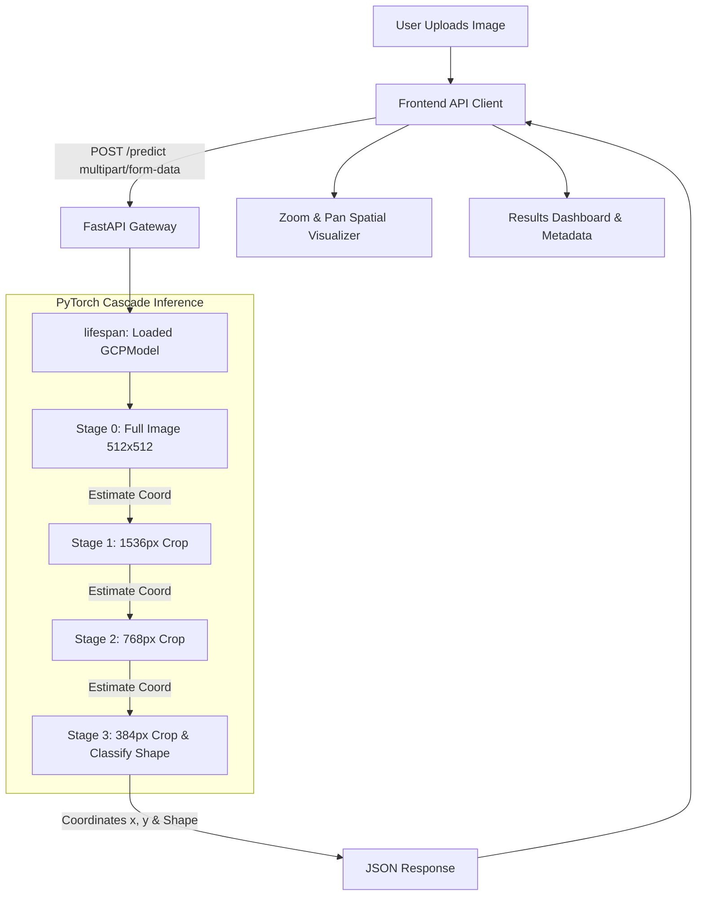

# Skylark GCP Pose Estimation System

A production-grade, end-to-end computer vision platform designed to localize Ground Control Points (GCPs) and classify marker shapes in high-resolution aerial imagery. 

The project connects a **Next.js 15 / TypeScript** web frontend to a **FastAPI / PyTorch** backend serving an **EfficientNet-B3** multi-stage crop cascade regression model.

---

## Architecture Overview

The core capability of the system is resolving scale-variance issues of GCPs in drone photography. High-resolution photos are passed through an iterative cropping cascade to achieve sub-pixel accuracy.



---

## Repository Structure

* **`backend/`**: PyTorch neural network codebase.
  * `app.py`: FastAPI server configuration with CORS and lifespan handlers.
  * `routes/predict.py`: Image upload prediction handlers and Pydantic schemas.
  * `services/predictor.py`: In-memory multi-stage cascade inference engine.
  * `src/`: Deep learning model architectures, datasets, loss functions, and trainer scripts.
  * `weights/`: Holds the trained checkpoint weights file (`best_pck.pth`).
  * `configs/`: Model hyperparameters configuration (`default.yaml`).
* **`frontend/`**: Interactive dashboard workspace.
  * `src/app/`: Next.js App Router and global CSS layouts.
  * `src/components/`: Reusable React components (Image visualizer, uploader, results, themes).
  * `src/lib/api.ts`: API integration query hooks and local simulator fallback.
  * `src/providers/`: Global theme and React Query managers.
* **`docs/`**: Engineering specifications and system design diagrams.
* **`notebooks/`**: Exploratory data analysis (`eda.ipynb`).
* **`sample-predictions/`**: Pre-computed ground truth annotations (`predictions.json`).

---

## Quickstart Guide

### 1. Run the Python Backend Server
Navigate to the `backend/` directory:
```bash
# Set up venv
python -m venv .venv
.venv\Scripts\Activate.ps1

# Install requirements
pip install -r requirements.txt fastapi uvicorn python-multipart requests

# Start model server
python -m uvicorn app:app --host 127.0.0.1 --port 8000 --reload
```
The backend will boot up and load the PyTorch weights, listening at `http://localhost:8000`.

### 2. Run the Next.js Frontend Dashboard
Navigate to the `frontend/` directory in a new terminal:
```bash
# Install dependencies
npm install

# Start development server
npm run dev
```
Open [http://localhost:3000](http://localhost:3000) in your web browser.

---

## Technical Specifications

| Parameter | Specification |
| --- | --- |
| **Backbone Architecture** | EfficientNet-B3 (pretrained ImageNet) |
| **Input Crop Resolution** | 512x512 pixels |
| **Regression head** | Sigmoid normalized output `[0, 1]` |
| **Shape classification** | 3-class classification logits (Cross, L-Shaped, Square) |
| **Cascade scales** | `[0, 1536, 768, 384]` (Full image -> 1536px -> 768px -> 384px) |
| **Accuracy Metric** | PCK@0.25 (Percentage of Correct Keypoints within 2.5px tolerance) |
