# System Architecture & Cascade Inference Design

This document details the engineering specifications for the AeroPoint AI Ground Control Point (GCP) Pose Estimation system.

---

## 1. System Integration Flow

The application is structured into a modular client-server architecture. The Next.js client handles files drag-and-drop, state updates, interactive rendering, and offline simulations. The FastAPI server handles inference requests on the model.

```mermaid
graph LR
    subgraph Client-Side (Next.js)
        UI[Workspace UI] <--> API[API Client Layer]
        API <--> SIM[Offline Simulator]
    end
    subgraph Server-Side (FastAPI)
        API <-->|HTTP POST /predict| Router[predict_router]
        Router <--> Predictor[GCPPredictor Service]
        Predictor <--> Model[GCPModel PyTorch]
    end
```

---

## 2. Multi-Stage Cascade Inference Model

GCP markers inside high-resolution (e.g. 4000x3000) drone photographs represent a very small percentage of the total pixel area, creating a severe scale mismatch for standard object localization networks.

To resolve this, the system uses a **Coarse-to-Fine Cascade inference pipeline**. A single model weights file (`weights/best_pck.pth`) is loaded, which was trained on multi-scale crops (varying from full image sizes down to 384px zoom windows). This allows the same neural network to perform coarse localization first, and recursively zoom in to resolve sub-pixel boundaries.

```mermaid
sequenceDiagram
    autonumber
    participant Client
    participant Server as FastAPI Server
    participant Model as PyTorch GCPModel

    Client->>Server: Upload image file
    Server->>Server: Resize image to 512x512
    Server->>Model: Forward pass (Stage 0: Full Image)
    Model->>Server: Coarse coords (x0_norm, y0_norm)
    Server->>Server: Denormalize coordinates to absolute pixel space (x0, y0)
    
    rect rgb(15, 23, 42)
        note right of Server: Cascade Zoom Loop: for scale in [1536, 768, 384]
        Server->>Server: Crop square window of scale size centered on (x_prev, y_prev)
        Server->>Server: Resize cropped window to 512x512
        Server->>Model: Forward pass (Stage i: Zoom Crop)
        Model->>Server: Refined coords (xi_norm, yi_norm)
        Server->>Server: Map coords back to absolute parent image pixels (xi, yi)
    end
    
    Model->>Server: Shape classification logits (final stage only)
    Server->>Client: Return final (x, y), Shape, and stage metrics
```



---

## 3. Coordinate Transformation Math

At each stage $i$ of the cascade, the model receives a $512 \times 512$ image representing a resized crop of scale $S_i$. The model predicts normalized coordinates $(x^{norm}_i, y^{norm}_i) \in [0, 1]^2$.

The backend translates this coordinate back into the original high-resolution image space coordinate $(x^{abs}_i, y^{abs}_i)$ using the crop window's offset $(L_i, T_i)$ and dimensions $(W^{crop}_i, H^{crop}_i)$:

$$x^{abs}_i = L_i + (x^{norm}_i \times W^{crop}_i)$$
$$y^{abs}_i = T_i + (y^{norm}_i \times H^{crop}_i)$$

For Stage 0 (Full Image):
* $L_0 = 0$, $T_0 = 0$
* $W^{crop}_0 = W^{orig}$, $H^{crop}_0 = H^{orig}$
* $x^{abs}_0 = x^{norm}_0 \times W^{orig}$
* $y^{abs}_0 = y^{norm}_0 \times H^{orig}$

For Stage $i > 0$ (Zoom Crop around previous estimate $(x^{abs}_{i-1}, y^{abs}_{i-1})$):
* $W^{crop}_i = \min(S_i, W^{orig})$
* $H^{crop}_i = \min(S_i, H^{orig})$
* $L_i = \text{clip}(x^{abs}_{i-1} - \frac{W^{crop}_i}{2}, \ 0, \ W^{orig} - W^{crop}_i)$
* $T_i = \text{clip}(y^{abs}_{i-1} - \frac{H^{crop}_i}{2}, \ 0, \ H^{orig} - H^{crop}_i)$

By using this recursive mapping, the final coordinates achieve extreme accuracy inside the tightest crop window (e.g., $384 \text{px}$ scale).

---

## 4. Model Architecture Details

The model architecture is defined in `backend/src/model.py`.

* **Backbone:** EfficientNet-B3. Pretrained ImageNet weights are loaded, and the global pooling layers and classification head are removed to expose the spatial feature tensor.
* **Neck:** Spatial Attention Pooling (optional) or Adaptive Average Pooling + Flattening, yielding a 1536-dimensional feature vector.
* **Keypoint Regression Head:** An MLP mapping features $\rightarrow 256 \rightarrow \text{ReLU} \rightarrow 64 \rightarrow \text{ReLU} \rightarrow 2 \rightarrow \text{Sigmoid}$. The output coordinates represent the normalized $(x, y)$ location in the crop bounds.
* **Shape Classification Head:** An MLP mapping features $\rightarrow 256 \rightarrow \text{ReLU} \rightarrow \text{Dropout} \rightarrow 3$, outputting class logits corresponding to:
  * Class 0: **Cross**
  * Class 1: **L-Shaped**
  * Class 2: **Square**
